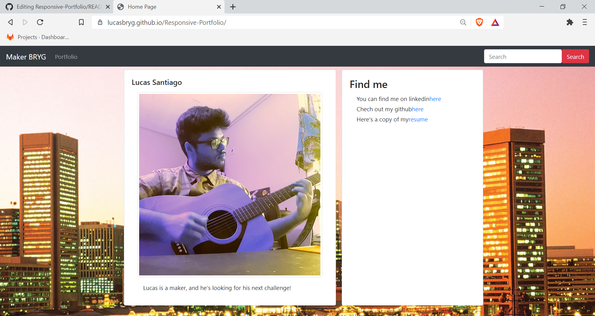

# Portfolio
Welcome to my website! On it you can find my contact infro, a copy of my resume, and a portfolio of some of my work!
Contact me at adio.lucas@gmail.com for any questions.
Find me on linked in at https://www.linkedin.com/in/lucas-bryg-codes/

### Live Page

https://lucasbryg.github.io/Responsive-Portfolio/

## Screenshot

Here's a screenshot of the Homepage

Here's a screenshot of my portfolio

Here's a Screenshot of my Resume

## Projects

### Trail Mixr

An web application I made with a group that allows a user to search for hiking, biking, running or climbing spots near them and gives them weather and condition info

https://lucasbryg.github.io/Group-Project-1/

#### Technologies

 - openweather API
 - hikingproject API
 - responsive framework
 - user's local storage

### Password Generator

A simple random password generator with 3 layers of psudo-randomness. User can select desired characters and lenght

https://lucasbryg.github.io/Password-Generator-App/

#### Technologies

 - psudo-randomization
 - string, array manipulation
 - responsive framework

### Weather Dashboard

This is a weather dashboard that allows a user to search for present and future weather conditions of their location. Their searches are saved in interactive table, and they can select previous searches to get the weather

https://lucasbryg.github.io/Weather-Dashboard-App/

#### Technologies

 - openweather API
 - responsive framework
 - user's local storage

## Author

- Linkedin -- https://www.linkedin.com/in/lucas-bryg-codes/
- GitHub -- https://github.com/lucasBRYG/